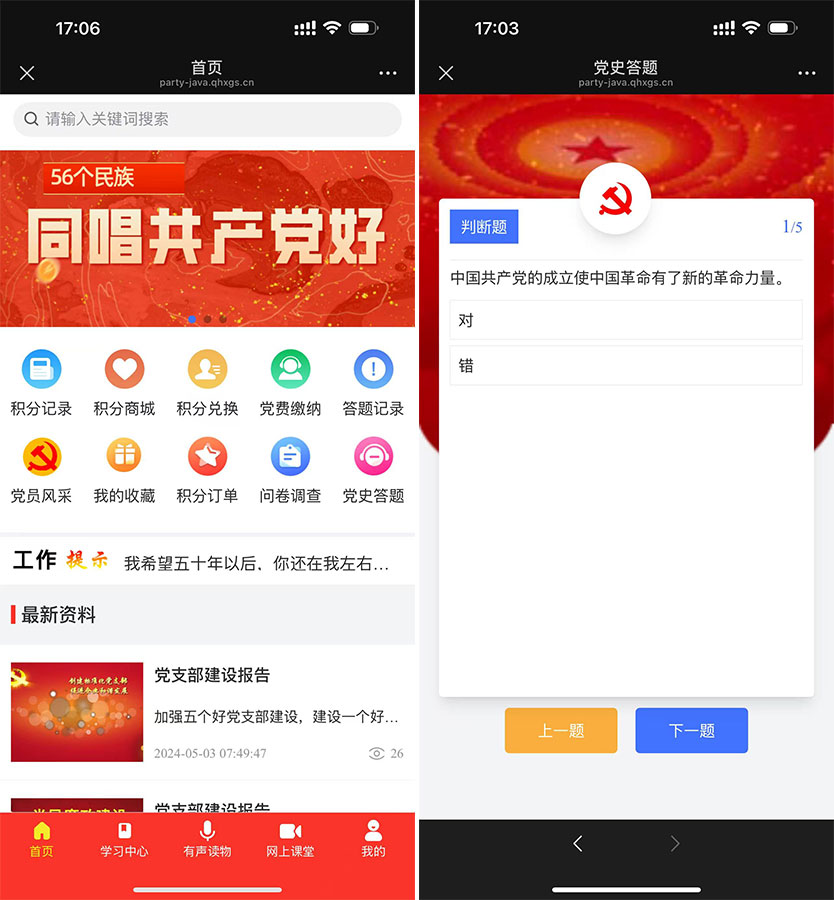
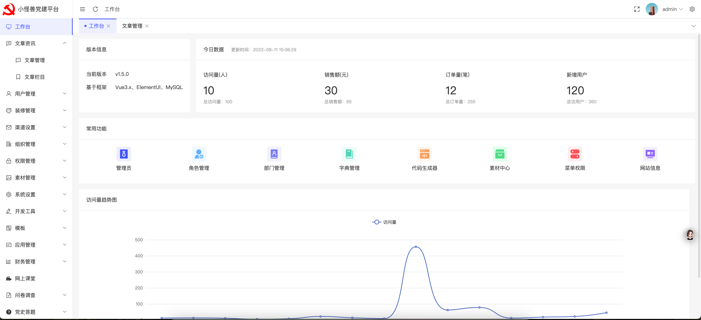

# 🌟小怪兽党建系统 Java 开源版🌟

## 一、系统简介

小怪兽党建系统 Java 版是一款专为现代党组织打造的综合性数字化管理平台🎯。它以创新的技术架构和丰富的功能模块，致力于提升党建工作的效率、增强党员教育的效果，并促进党组织内部的沟通与协作，为党建事业注入新的活力与动力💪。

系统演示: [点击查看付费版演示](https://qhxgs.cn/docs/detail/4) 

部署文档：[点击查看部署文档](https://qhxgs.cn/docs/detail/8)

## 二、核心价值

1. **高效管理**：通过智能化的党员管理模块，实现党员信息的精准录入、便捷维护以及组织架构的灵活调整，大大提高党组织的日常管理效率🚀。

2. **强化教育**：丰富多样的学习教育模块，提供海量的在线课程、有声读物和学习文章，助力党员随时随地开展学习，提升政治素养和理论水平📚。

3. **活跃组织**：创新的活动运营模块，涵盖问卷调查、党史答题和积分商城等功能，激发党员参与活动的积极性，增强党组织的凝聚力和活力🎉。

4. **便捷服务**：贴心的日常服务模块，支持党费在线缴纳和及时的工作提示，为党员和党组织提供便捷、高效的服务体验💌。

## 三、技术亮点

1. **后端技术栈**
- **Spring Boot**：作为后端核心框架，以其高效的开发体验、强大的自动配置功能和优秀的生态系统，确保系统的快速开发和稳定运行🛠。

- **MyBatis Plus**：强大的 ORM 框架，简化数据库操作，提高开发效率，同时支持灵活的 SQL 编写，满足复杂业务需求💾。

- **Sa-Token**：专业的权限认证框架，保障系统的安全可靠，实现精细的权限管理和灵活的会话控制🔒。
2. **前端技术栈**
- **Vue3 + TypeScript**：Vue3 的响应式原理和组合式 API 搭配 TypeScript 的强类型检查，打造出高效、可维护的前端应用，提供流畅的用户交互体验👀。

- **Tailwind CSS**：原子化 CSS 框架，通过丰富的实用类轻松构建美观、响应式的界面，满足不同设备的显示需求📱。
3. **跨平台技术**
- **UniApp**：实现一套代码多端运行，无缝适配微信小程序、APP 和 H5 页面，极大降低开发成本，提升开发效率💻。

## 四、功能模块详解

1. **党员管理模块**
- **信息精准掌控**：支持党员信息的批量导入导出，提供全面的信息校验，确保数据准确无误📋。

- **组织架构清晰**：通过树形结构管理组织架构，明确部门、岗位与职责，实现高效的组织协同🤝。

- **权限精细管理**：基于 RBAC 模型的权限管理系统，灵活分配角色权限，保障数据安全和操作规范🔐。
2. **学习教育模块**
- **在线课堂互动**：高清视频播放、实时互动评论，让学习不再枯燥，打造沉浸式学习体验📺。

- **有声读物丰富**：精心制作的有声读物，支持章节划分，满足党员多样化的学习需求🎧。

- **学习中心全面**：海量文章发布，详细的阅读统计，助力党员深入学习党的理论和知识📃。
3. **活动运营模块**
- **问卷调查灵活**：自定义问卷创建，智能数据统计分析，为党组织决策提供有力支持📊。

- **党史答题趣味**：丰富的题库管理，积分奖励机制，激发党员学习党史的热情和积极性🎁。

- **积分商城便捷**：多种商品兑换，流畅的订单管理，提升党员参与活动的获得感和满意度🛍。
4. **日常服务模块**
- **党费缴纳便捷**：支持多种在线支付方式，自动生成缴费票据，提醒及时准确，让党费缴纳轻松便捷💰。

- **工作提示及时**：滚动通知与重要事项标记，确保党员和党组织及时掌握关键信息📢。

## 五、安装与部署

1. **环境准备**
- **后端**：JDK 11+、MySQL 8.0+、Redis 7.0+。

- **前端**：Node.js 18+、HBuilderX 3.8+。
2. **部署流程**
- **后端部署**：简单几步配置数据库、Redis 等参数，通过 Maven 编译启动，轻松完成后端服务部署🚀。

- **前端部署**：在 HBuilderX 中进行简单配置，即可一键打包生成微信小程序、APP 和 H5 版本，实现多端快速发布📱。

## 六、使用指南

1. **管理员操作手册**：详细的后台管理界面导航，轻松进行组织管理、内容发布和数据统计。灵活的权限配置与角色管理，确保系统管理的高效与安全🔐。

2. **党员用户操作手册**：简洁明了的操作指引，方便党员参与学习教育、活动互动，便捷完成党费缴纳和个人信息管理，享受贴心的党建服务💌。

## 七、二次开发支持

1. **代码结构清晰**：后端采用标准的 Controller/Service/DAO 分层架构，前端基于 Vue3 和 UniApp 的组件化、路由化设计，代码结构清晰，易于理解和扩展📂。

2. **功能扩展示例**：提供丰富的功能扩展示例，如添加党建活动报名功能、定制个性化界面样式，助力开发者快速实现定制化需求🎯。

3. **接口文档完善**：详细的 API 接口文档，明确接口定义、请求参数和响应数据，方便与第三方系统集成和二次开发🔌。

## 八、系统演示与测试

1. **功能演示视频**：提供详细的后台管理操作流程演示和前端多端交互演示视频，让您直观感受系统的强大功能和流畅体验🎬。

2. **测试用例完备**：全面的核心功能测试用例，包括党费缴纳、积分兑换等，严格的压力测试和性能优化建议，确保系统在各种场景下的稳定运行和高效性能💯。

## 九、常见问题与解答

1. **部署问题**：详细的数据库连接失败排查指南、跨域配置与接口调试方法、Maven 编译报错处理方案，助您快速解决部署过程中遇到的问题🛠。

2. **功能异常**：提供支付接口调试指南、积分规则配置错误修复方法，保障系统功能的正常使用，为您排忧解难💡。

## 十、联系我们

1. **官方社区**：加入我们的官方社区，与众多开发者和用户交流经验，获取最新的系统资讯和技术支持💬。

2. **技术支持渠道**：提供专业的技术支持邮箱和电话，随时为您解答疑问，确保您在使用系统过程中无后顾之忧📞。

选择小怪兽党建系统 Java 版，开启党建工作数字化新篇章，携手共创更加美好的党建未来🎉！

你是否对文档中的某些技术细节或功能介绍有进一步优化的想法？或者希望再添加一些特定案例，都可以随时告诉我。
